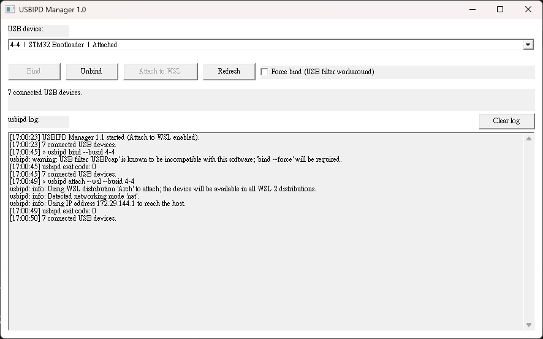

# USBIPD Manager

USBIPD Manager is a lightweight Win32 GUI for usbipd-win. It lists connected USB devices and provides Bind, Unbind, Attach to WSL, Refresh, force-bind, and command log controls.

## Requirements

- Windows 10/11
- WSL 2
- [Download usbipd-win](https://github.com/dorssel/usbipd-win/releases)

The program is written in C++17 with the pure Win32 API and compiled using Embarcadero Dev-C++ 6.3 with MinGW.

